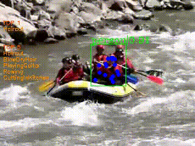

# Skeleton-based Action Recognition

## Introduction

This paper presents the work done to recognize through the skeleton's key points the action that a person performs in a video. To do this, it was implemented a model of dynamic skeletons called Spatial-Temporal Graph Convolutional Networks which automatically learns both the spatial and temporal patterns from data. The UCF101 data-set, which consists of 101 action classes, over 13.000 clips and 27 hours of video data, was used in this work. The project, which followed a complete common workflow for an effort of this type, was splitted in the following steps: 1. Data preparation, 2. Training, 3. Testing, and 4. Presentation: application creation of the skeleton-based action recognition. Though the accuracy of the results obtained after working with the UCF101 data-set is not as good as it would have been desired, the way to increase these results was detected and proposed. Furthermore, a broad platform (OpenMMLab) that was used in this project is referred to be considered to continue working on this topic and/or any other related with Computer Vision.

<p align="center">
    
</p>

<p align="center">
    
</p>
## Updates
- [2020-10-19] v0.1 is released.

## License
The project is release under the [Apache 2.0 license](./LICENSE).

## Contact
For any question, feel free to contact
```
AMEZCUA Luis     : luis.amezcua@aalto.fi
```
